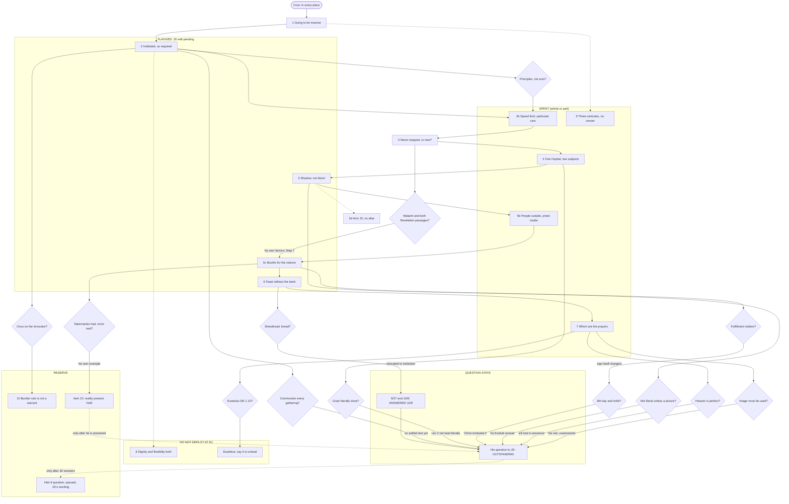

# Incense Outline Memory Card

<!-- PURPOSE HEADER. Maintained in place, not appended. -->

**AUDIENCE:** JD only.
**CLASS:** INTERNAL, not relay-clean; this file contains sequencing and branch material by design.
**FUNCTION:** Memory aid derived from `Incense_Conversational_Outline.md`.
**HANDLING:** Never shared, never relayed.

<!-- END PURPOSE HEADER -->

**Last updated: 260835-75** (date-stamped, format yymmdd-iteration)

> **DERIVATION POINTER.** Derived from `Incense_Conversational_Outline.md` at its stamp **260835-75** (working tree on `HEAD` `a33442f`, uncommitted pass edits included): every step, the dated notes beside them (including the four `260835-75` notes and the nine `260835-74` notes), the Deployment map, the `260835-72` overlay and its sixteen-item reserve register with the `260835-75` status lines, the `260835-74` REVIEWED blocks, the `260835-75` REVIEWED block, and the `260835-75` overlay. Question state is taken from `PROJECT_STATE.md` §1 to §3 and `RJ_Final_Question_List.md` v24, both at `260835-75`. Quotations attributed to Rev. James are taken from `St_Francis_EMC_Distinctives.md` (`DQ-38`…`DQ-40` minted `260835-75`) and checked against `src/SRC_Discord_Followup-raw.txt` (sha256 `63920d32…`).
>
> **This card changes nothing in the outline. If the card and the outline ever disagree, the outline wins and the card is stale.** Once the outline's stamp moves past `260835-75`, treat the card as stale until it is re-derived.
>
> *Pointer history, retained:* **(1)** `260835-73`: derived from the outline at **260835-72** (repo HEAD `a5d8cc9`); question state from `PROJECT_STATE.md` §1 to §3 and `RJ_Final_Question_List.md` v23, both at `260835-72`; Followup quotations checked against the raw at sha256 `48bb0a58…`. **(2)** `260835-74` dated note: *"the outline's stamp moved to `260835-74` … this card was **not** re-derived, so by its own rule above it is **stale until it is**. The pointer above is left at `260835-72`."* Discharged by the `260835-75` re-derivation.

## Changelog

- **260835-75 (2026-10-09):** Card RE-DERIVED from `Incense_Conversational_Outline.md` at its stamp `260835-75`, after the outline's C11 review of `DQ-38`…`DQ-40` (Rev. James's three 10/9 replies) and its `260835-75` overlay. The derivation pointer moved from `260835-72` to `260835-75`, with the prior pointer and the `260835-74` stale note retained in its history. Structure (Layers A to D), header and the `260835-73` and `260835-74` entries preserved. **Layer A:** every step's state updated from the Deployment map and the `260835-75` overlay; Steps 2, 5, 5c and 6 marked "FLAGGED: JD edit pending" (this pass's flags), and the `260835-74` flags carried as "FLAGGED (`260835-74`): JD decision pending". The Step 2 cue of record is now the posted form, *"any worship that God institutes, He also requires it to be performed"*, with *"God doesn't institute worship yet not require it"* kept beside it as the first-captured form, superseded by JD's in-place edit; the frequency flag sits beside the cue. Step 2b is shown SPENT (9/17), per the `260835-74` correction. The `260835-74` dated note below the table is retained, marked superseded. **Standing guards:** five added (his question first; his questions stay questions; his citation as given; JD's words inside his posts; Step 3 and 5c "figure"). **Layer B:** six branches added in his own stated words with their tags (the 8th-day reductio, `DQ-38`(c); "the sign did continue for Shewbread: bread", `DQ-40`(a); the warrant claim, `DQ-39`(c); Tabernacles and the ark as presence, `DQ-39`(a); the Communion-frequency question, `DQ-40`(c), whose row reads "FLAGGED: outline has no settled text; JD edit pending"; the "picture of the scene" criterion, `DQ-39`(e), joined to the existing literal-meaning row). Existing rows updated; the veil-continues row marks its trigger fired in substance and reserve item 15's guard. The Hanukkah row and the bloody-only row are kept in the table (the latter extended with `DQ-38`(a)) and dropped from the flowchart only, to hold its node count. Every branch now ends at "RJ's counter-question is outstanding; answer it before asking anything new." **Layer C:** subgraphs updated (SPENT; FLAGGED: JD edit pending; RESERVE; DO NOT DEPLOY AT RJ; QUESTION STATE), six decision diamonds added, two dropped (the bloody-only and Hanukkah diamonds, with the Hanukkah terminal node); 33 nodes. `mmdc` is not installed, so nothing was rendered and nothing was installed. **Layer D:** the spoken core verbatim, with its guards extended; the 60-second compression unchanged; the drill restructured (questions 1 and 2 ANSWERED with tags and dates; question 3 RESERVE; the rule line that RJ's question is answered first). No question or answer is written anywhere in the card.
- **260835-74 (2026-10-09):** One dated note added below the Layer A table: Step 2's prescribed-not-permitted point was posted on 10/9 in JD's own words, byte-verified in both captures of the Followup raw, with the wording JD later edited recorded beside the wording that now stands. One dated stale note added beside the derivation pointer, because the outline's stamp moved to `260835-74` and the card was not re-derived. No row of any table was edited.
- **260835-73 (2026-10-09):** Card created. It has four layers: (A) the logical flow, one line per step in the outline's order, each with a cue, a one-sentence claim, an anchor and the step's state from the Deployment map; (B) the branch map for twelve anticipated replies, each ending at one of the two open questions; (C) a Mermaid flowchart with SPENT, RESERVE and DO NOT DEPLOY AT RJ subgraphs; (D) the spoken core verbatim, a labeled 60-second compression, and the three-question drill. Four brief items were corrected against the record rather than carried. (1) Luke 1:9-10 puts the people outside and Zacharias inside; the brief's cue had them reversed. (2) Cyril's reading is Tier 1, verified by JD against the page on 2026-10-09 (`260835-72`); the brief's "print check pending" is stale. (3) The brief's guard "he has stated no sorting rule" is superseded by `DQ-37`(b), "fulfillment widens"; the three-pattern sort remains the project's. (4) "Instituted means required" is not used as a cue, because that phrase was never posted (grep 0, `260835-72`). The brief's cue "nobody keeps Leviticus 2" is also replaced by a modal-split cue, because "nobody keeps" has the same shape as the "nobody performs" clause the outline retired at `260835-3`. The only other edits are in `PROJECT_STATE.md`: a new §4 row for this card, one changelog line, and that file's own stamp and §4 row bumped to `260835-73` so that its version check (C3) stays in agreement.

**How to read the tags.** `[Stated, tag]` means his own words, on the record. `[Analysis]` means the project's inference, never his. "JD" marks JD's own posted words. Quotations are here so a reply is recognized on the spot; before any of them is quoted back at him, check it against its source. **FLAGGED: JD edit pending** marks a step whose outline text has a dated note asking for JD's edit; do not reach for that step's wording as it stands.

---

## Layer A: the logical flow

| Step | Cue | Claim | Anchor | State |
|---|---|---|---|---|
| Core | In every place | The core names one claimed act of worship and two warrants that pull apart, and it ends with the prayers we already offer. | Mal 1:11; Rev 5:8 | UNSPENT; never spoken aloud. **FLAGGED (`260835-74`): JD decisions pending** on two exposed clauses (`DQ-28`(d); `DQ-37`) and on `IP-114`, plus the closing grammar against reserve item 12. |
| 1 | "Going to be incense" | Start from the defender's own claim: incense is a Godward act on Malachi's warrant, so only the warrant is in question. | Mal 1:11; [Stated, `DQ-19`(c)] | UNSPENT. **FLAGGED (`260835-74`): JD decision pending** on the "violation" clause (`DQ-28`(d)); it now also meets *"try to avoid judgement of it myself"* [Stated, `DQ-40`(b)]. |
| 2 | **Cue of record:** "any worship that God institutes, He also requires it to be performed" (JD, 10/9, as posted after JD's in-place edit; the form he quoted). *Beside it, superseded:* "God doesn't institute worship yet not require it" (the first-captured form, replaced by JD's edit). | Incense is an element by its defenders' own account, and "expected but not required" is a fourth category that owes an account. | [Stated, `IP-12`]; JD 9/17 (the framework); JD 10/8 (WCF 1.6/21.1); JD 10/9 (what God institutes he requires) | SPENT 9/17 (framework), 10/8 (WCF line), 10/9 (what God institutes he requires). Practice answered 10/9 (`DQ-40`(b)). **FLAGGED: JD edit pending.** ⚠️ **Frequency flag:** the step does not separate an element's being required from how often it is administered; his question on Communion's frequency (`DQ-40`(c)) is OUTSTANDING TO JD; WCF 21.5 is the candidate text to consult. |
| 2b | Speed limit, particular cars | A principle of worship is a principle about acts, and a rule that admits by resemblance filters nothing. | Ex 32:5 (a "feast to the LORD"); the Decian certificate | SPENT 9/17 (points 1 to 3 and the held fifth argument) and 10/4 (the act-level texts); unanswered by him. Generic framing only. |
| 3a | Never rescinded, then Exodus 30 | If incense never stopped, Exodus 30 never stopped either: sanctuary only, Aaron's sons only, the prescribed compound only. | Exod 30:1-9, 37-38; Lev 10:1-2; Heb 7:12 | PART-SPENT (Exod 30 on 10/4; Heb 7:12 on 10/8, 10/9). The continuity horn is not his (`DQ-37`(b); `DQ-38`(e)). |
| 3b | One verse, no institution | A new institution would rest on one prophetic verse in cult vocabulary, with no New Testament institution and no specified content. | Mal 1:11; 1 Tim 2:8; Rev 5:8 | SPENT 10/8, restated 10/9. **ANSWERED 10/9, 5:24 PM** (`DQ-40`(a): "bread"; Malachi again); his warrant named 10/9 (`DQ-39`(c)). **FLAGGED (`260835-74`): JD decision pending** at 3(b)(1) (`IP-119`). |
| 3c | One claim, not two | Calling continuity and prophecy one claim assumes the disputed "never rescinded" and moves the argument to the priesthood. | Heb 7:12; Lev 16:12-13 | UNSPENT. His third reading stated 10/8 (`DQ-37`(b)), and again 10/9 as a concept carried over (`DQ-38`(e)). |
| 3d | Why need Malachi? | If it never stopped, why does it need Malachi; if Malachi institutes it, why insist it was never rescinded? | Step 3(d) wording | UNSPENT; fork not put. |
| 4 | One Hophal, two subjects | Incense and the *minchah* share one verb, and no new rite was instituted for incense as the Eucharist was for the offering. | Mal 1:11 (*mugash*); Lev 2 | SPENT 10/8 (posted form), 10/9 (modal split). Not answered as such. `DQ-40`(a) leaves the `RJ_Incense_Analysis.md` §4.6/§4.8 seam FALSIFIED-PENDING-REVISION. |
| 5 | Shadow, not blood | Scripture's line is shadow and substance, and Levitical-priesthood signs cease unless Christ reinstitutes them. | Col 2:16-17; Heb 9:2-4; Lev 24:7 (frankincense on the loaves) | SPENT 10/9; **the reinstitution sentence REJECTED in terms 10/9** ("100% disagreement", `DQ-39`(d)). **FLAGGED: JD edit pending** (`260835-75` note at the narrow principle). **FLAGGED (`260835-74`): JD decisions pending** on the circumcision illustration and the `IP` rivals. |
| 5b | People outside, Zacharias inside | The incense meant prayer carried in by a priestly mediator, and both referents are present realities now. | Luke 1:9-10; Lev 16:12-13; Heb 7:25 | PART-SPENT 10/8, 10/9; re-staged distance unspent. **FLAGGED (`260835-74`): JD decision pending** at question 4. |
| 5c | Booths for the nations | Every parallel prophecy in Levitical vocabulary is read as figure, so Malachi's incense cannot be the lone literal case. | Zech 14:16; Jer 33:18 (Levites kindling the *minchah*); Mal 3:3-4 | PART-SPENT 10/8, 10/9; **Zech 14:16 ANSWERED by him 10/9 as fulfilled** ("We continually have the Feast of the Tabernacles", `DQ-39`(a)). Mal 3, Isa 19 and Jer 33 unspent. **FLAGGED: JD edit pending** (the step's "read as figure" wording). |
| 5d | Acts 15, no altar | Temple attendance before AD 70 was accommodation, and the apostles never routed the Gentiles to the altar. | Acts 21:23-26; Heb 8:13; Acts 15 | PART-SPENT 10/9 (Acts 15 in one sentence); not taken up by him. |
| 6 | Feast without the lamb | The command lands on the signified reality, and every continued sign received a new institution; the Passover is his own example. | 1 Cor 5:7-8; [Stated, `DQ-8`]; 1 Tim 2:8 | UNSPENT as argument; Passover named once 10/9. **FLAGGED: JD edit pending** (the Supper paragraph against *"The sign did continue for Shewbread: bread"*, `DQ-40`(a)). |
| 7 | Which are the prayers | We join heaven's worship, but the vision glosses its own furniture, and the image-needs-use rule is applied only where practice already is. | Rev 1:20; 4:5; 5:8; 19:8; 11:19 (ark in heaven too) | PART-SPENT 10/8, 10/9. Revelation now named by him as warrant, in the plural (`DQ-39`(c)). Four-verse cluster unspent. |
| 8 | Dignity and flexibility both | Warranted human ordering wants divine dignity and human flexibility at once and cannot say which governs. | Articles 20 and 34; [Stated, `IP-12`] | DO NOT DEPLOY AT RJ (he affirmed the RPW, `DQ-4`); third parties only. **FLAGGED (`260835-74`)**, and see `DQ-40`(b)'s "bending over backwards". |
| 9 | Three centuries, no censer | English worship was incense-free from the late 1540s to the 1850s, and the practice was condemned when tested. | *Elphinstone v. Purchas* 1870; the 1899 Opinion; Church of Ireland canon | SPENT 9/5, 9/8, 9/17, 9/27; closed by JD 9/17. **FLAGGED (`260835-74`)**: the 1899 gloss; the Church of Ireland attribution (a canon, not the Prayer Book) is owed. |
| 10 | Burden rule is not a warrant | A rule for who must argue, or for what was received, gives no positive grounds for incense. | [Stated, `DQ-19`(a), `DQ-24`(b), `DQ-33`(b)] | RESERVE; trigger: "the onus is on the innovator". |

*Row 5c's Claim is the step's own wording, which is FLAGGED: spoken to him, "figure" invites the allegory charge (`DQ-39`(e)). The wording is JD's to change.*

> *Retained from `260835-74`, superseded by the `260835-75` re-derivation (Row 2 above now carries both wordings and the cue of record):*
>
> ⭐ **DATED NOTE, 260835-74 (2026-10-09) — STEP 2's PRESCRIBED-NOT-PERMITTED POINT WAS ALSO POSTED ON 10/9, IN JD's OWN WORDS. THE TABLE ROW ABOVE IS NOT EDITED.** Its State cell reads *"PART-SPENT 10/8 (WCF line); framework unspent"*. **Add: SPENT 10/9 as well as 10/8.** JD's 10/9 3:23 PM post closes with the point stated as a consequence of Rev. James's own reading (archive message 61 of `src/SRC_Discord_Followup.md`).
>
> - **As first posted** (raw capture sha256 `48bb0a58…`, the `f69fbd4` state): *"If Malachi 1:11 institutes incense for the church in any sense, then it's required, because God doesn't institute worship yet not require it"* — **[byte @82,872–83,012]**, uniqueness-checked (1 occurrence). The cue *"God doesn't institute worship yet not require it"* is **[byte @82,964–83,012]** in that capture.
> - ⚠️⚠️ **As it now stands** (raw capture sha256 `63920d32…`, `HEAD` `47a8a4b`): JD **edited the post in place** after the `f69fbd4` capture. The sentence now reads *"If Malachi 1:11 institutes incense for the church in any sense, then it's required, because any worship that God institutes, He also requires it to be performed"* — **[byte @82,872–83,032]**. The paragraph continues *"; and as a result, if it only permits incense, then it doesn't institute it."* ⛔ **The brief's wording, *"God doesn't institute worship yet not require it"*, does NOT occur in the current capture (0 occurrences).** ⭐ **Rev. James's 10/9 5:24 PM post quotes the EDITED wording** (**[byte @87,696–87,856]**, archive message 64), so the edited form is the text he answered.
> - **Available Step 2 cues, both JD's own words:** *"God doesn't institute worship yet not require it"* (as first posted; short and memorable; no longer in the posted text) and *"any worship that God institutes, He also requires it to be performed"* (as it now stands; the form on the record and the form he quoted). ⏳ **Which to carry as the cue is JD's choice.** Recorded rather than chosen.
> - ⚠️ **The point is no longer unanswered in the thread.** Rev. James's 5:24 PM post (archive message 64) quotes this paragraph and replies to it. ⛔ That reply is **not yet minted** (no `DQ-38`), so the card does not characterise it. Read it in the archive before relying on this cue.
> - *(The 260835-74 C11 review also found that Step 2's three-category framework was posted in full on 9/17, which the row's "framework unspent" does not reflect. See the outline's `260835-74` REVIEWED block. The row is left as derived.)*

## Standing guards (these travel with every layer)

- **His question is first.** His 10/9 5:24 PM question to JD (`DQ-40`(c), on Communion's frequency) is OUTSTANDING TO JD. One committal question per turn: nothing new goes to him until JD has answered it. It is a question, and it is never restated as an assertion of his.
- **Attribution.** Never attribute "violating Malachi 1:11" to him. That line is a rhetorical question inside his own reductio (`BP-39`), and the generic framing in the core and Step 1 must stay generic.
- **His questions stay questions.** *"Why do you not insist that an infant be Baptized on the 8th day and that a knife and bleeding be involved?"* (`DQ-38`(c)) is a reductio aimed at JD's method; its operative sentence is a question inside his argument. *"Is it a sin?"* (`DQ-40`(b)) is a question he poses inside his own answer, and his answer to it is that he avoids judging. Neither is ever quoted as a flat claim.
- **His citation as given.** He wrote *"John 1:5"* for Tabernacles fulfilled (`DQ-39`(a)). John 1:14 is the verse normally cited, and that is the project's note, not a correction. Quote it as he gave it, or ask.
- **JD's words inside his posts.** Messages 63 and 64 quote JD's 10/9 sentences in quotation marks. Those are JD's words, never his.
- **Rev 5:8 grammar.** Say "the bowls full of incense are the prayers." Never say "the incense is the prayers." The Rev 8:3 "with the prayers" form is RETIRED (do-not-deploy register), and JD used it once, on 10/8. He now names *"both Revelation Passages"* as warrant (`DQ-39`(c)); which two is the project's identification.
- **Misattribution.** "On 9/8 you read it as fulfilled in the Eucharist" is a MISATTRIBUTION and is DO NOT DEPLOY. JD said the fathers read it so; he has not said so on Discord.
- **Step 5.** Use the narrow principle only. The broad form, "fulfilled symbols cease," is DO NOT DEPLOY. His "uniquely Old Testament" qualifier (`IP-100`) answers Step 5 in one sentence if it is used without that qualifier in hand. He has now rejected the reinstitution sentence in writing ("100% disagreement", `DQ-39`(d)).
- **Step 3 and Step 5c.** He reads the clause as fulfilled, not as figurative, and he charges JD with allegory by a stated criterion (*"describing a picture of the scene"*, `DQ-39`(e)). Never call his reading figurative or allegorical, and treat the outline's "figure" wording as FLAGGED.
- **Step 4.** Use the modal-split form only ("may be kept in the antitype; it is certainly not kept literally, by either of us," JD 10/9). Never charge him with spiritualizing one clause. The *minchah* seam objection is undischarged, and nothing may be built on his having noticed the asymmetry (`IP-98`).
- **Step 7.** Its machinery does not reach the Incarnation ground (`IP-103`: "Heaven and Earth are united"). If that ground comes up live, Step 7 has no answer ready.
- **The one hole.** The ritual-act-as-pedagogy warrant (`IP-101`) is met by no step. A conversation that reaches it has nothing prepared.
- **Not quotable at him.** `IP-84`, `IP-114`, `IP-118` and `IP-120` are under open ear flags. `IP-85` is absolute DO NOT DEPLOY. Eusebius *DE* 1.10 is UNREAD. The Perowne and Simeon wordings are unverified and unsourced.
- **Step 9 history.** The 1974 Measure repealed the Act of Uniformity 1662 "except sections 10 and 15." Never say a bare "repealed." The history also does not defeat incense on his own durational floor (`DQ-26`(b)), so do not claim that it does.
- **Step 8** is DO NOT DEPLOY AT RJ, whatever the temptation.

---

## Layer B: the branch map

Each row starts from a reply the outline anticipates or one he has now made. Where he has stated the move, it appears in his own words with its tag; where he has not, the row says so. "Go to" and "Say" point only at steps and material the outline already holds. **Every branch now ends at the same place: his question to JD is outstanding, and it is answered before anything new is asked.**

| If he says | Go to | Say | Guard |
|---|---|---|---|
| "An image doesn't work if it's not being used. It has to be used for it to work." [Stated, `BP-38`, video]; "a symbol doesn't work well if it's not there" [`RC3-8`]. Not said in the Followup thread. | 5b, then Step 7 cluster | Reserve item 1: the veil, whose meaning works because it is gone (Heb 10:19-20); then Step 7's question why the image-needs-use rule applies only to the one glossed item already in practice. | Neither answer reaches the `IP-103` Incarnation ground. The veil sentence was posted 10/9 as a statement, and he has not answered it as to the veil. |
| "I would need a strong argument as to why we should not allow that particular practice, given that Heavenly worship is perfect." [Stated, `DQ-16`] | Step 7; Rev 11:19 | Step 7: we do join heaven's worship (Heb 12:22-24). Reserve item 13: the ark is in heaven's temple too (Rev 11:19), and his own 10/9 answer has the ark had in presence, *"more real"* (`DQ-39`(a)). | Concede participation in full and contest only the inference to physical reproduction. Rev 11:19 was posted 10/9 and answered in his words. |
| "It does if the Scriptures give us warrant to believe that. Malachi 1:11 and both Revelation Passages do." [Stated, `DQ-39`(c)]; "Malachi 1:11 is then sufficient" [Stated, `DQ-37`(b)]; "Malachi 1:11 is, again, where I point to." [Stated, `DQ-40`(a)] | Step 3b; Step 7; Step 5c | Step 3b: no New Testament institution and no specified content. Step 7: the vision glosses its own furniture (Rev 1:20; 4:5; 5:8; 19:8). Reserve item 2: his own factors, "context to feasibility to purpose" [Stated, `DQ-17`]. | The two Revelation passages' identification (Rev 5:8; Rev 8:3-4) is the project's. Two readings of "It does" are live (`DQ-39`). Reserve item 12's grammar governs Rev 5:8. |
| "I need a strong case to deny the literal meaning of it for the sake of the allegorical." [Stated, `DQ-37`(d)]; "when the words aren't describing the scene in the way a person describing a picture of the scene would, it is difficult to call that literal" [Stated, `DQ-39`(e)]; "Allegory can be thrown at almost anything to make it fit one's theology." [Stated, `DQ-38`(d)] | Step 5c; Step 3 (`260835-2` note) | Reserve item 3: his own Ezekiel answer, "more or less apocalyptic," limited by Hebrews [Stated, `DQ-18`]. Step 3's `260835-2` note: he reads the clause as fulfilled, not figurative, and JD has said the same of fulfillment ("Fulfillment isn't figurative," 10/9). | He acknowledged JD's denial himself ("I know you are denying that"). Never call his reading allegorical back at him. Step 5c's "figure" wording is FLAGGED. Cyril's v.12 line must be read with the spiritual-incense gloss before it. |
| "We continually have the Feast of the Tabernacles. John 1:5. We have the Ark continually before, in, with, and through us. … This is what it means for it to be a fulfillment. It is more real." [Stated, `DQ-39`(a)] | Step 5b; Step 5c; Step 5 | Step 5b: both referents are present realities now. Step 5's `260835-75` note: his own ark example, under the standing rule that his own example outranks the project's version. | Citation recorded as given ("John 1:5"). Two readings are live (`DQ-39`): no ark built on either. He has not said incense is had the same way; that parallel is reserve item 15's and is held. |
| "the fulfillment is always more and greater than the foreshadow"; "would allow for more than just Aaron's descendants to use incense" [Stated, `DQ-37`(b)]; "what Circumcision pointed to, Baptism brings us to"; "we carry over and widen its application from Old to New" [Stated, `DQ-38`(a)/(e)] | Step 5 narrow principle | Step 5: his own examples ceased and were replaced, and he grants the sign changed (*"the sign itself is not Circumcision"*, `DQ-39`(d)). Reserve item 11: the ark and veil controls (Heb 9:4; 10:20). | His sorting rule is "fulfillment widens". The three-pattern sort is `[Analysis]`, the project's, and must never be put to him as his. Step 5 is FLAGGED. |
| "Why do you not insist that an infant be Baptized on the 8th day and that a knife and bleeding be involved?" [Stated, `DQ-38`(c); a reductio, its operative sentence a question] | Step 5 (the reinstitution clause) | Step 5: baptism and the Supper continue *"because Christ instituted them, in the new form, by name."* | Never restate the question as a claim of his. The reading that baptism's mode, subjects and day come from its own institution (WCF 27.5, 28.4) is the project's, recorded at the ledger only. |
| "The sign did continue for Shewbread: bread." [Stated, `DQ-40`(a)] | Step 6; Step 5 | Step 6's Supper paragraph: a continued sign receives a new institution (Luke 22:19; 1 Cor 11:23-25). **FLAGGED: JD edit pending at Step 6.** | This is his answer to the 10/8 question. Whether it relocates the question or resolves it is JD's to judge. |
| "is it your understanding that since Communion is instituted, to not have Communion every time the Body of Christ gathers for corporate worship is to sin? Not even I would say that" [Stated, `DQ-40`(c)] | Step 2 | **FLAGGED: outline has no settled text; JD edit pending.** The step does not yet separate existence from frequency; WCF 21.5 is the project's candidate text to consult. | OUTSTANDING TO JD. A question, never an assertion. Answer it before asking anything new. |
| The veil continues as Christ's flesh, with wider access, so widening is the pattern. (Anticipated; he has not said it of the veil.) **Trigger fired in substance 10/9, for the ark and Tabernacles** (`DQ-39`(a)). | Agree (reserve item 15) | Reserve item 15: the sign ceasing, the reality present, access widened to the reality. | The item's incense parallel is JD's to spend or not, and not before his question is answered. Not drafted here. |
| The grain offering is "literally done today," so both clauses are enacted. [`IP-114`, in person; open ear flag; NOT quotable] | Step 4 institution pivot | Step 4 as posted: the Eucharist is a rite Christ instituted; the Leviticus 2 rite may be kept in the antitype, and it is certainly not kept literally, by either of us. | The *minchah* seam objection is undischarged. Never allege that he spiritualizes one clause. |
| "The onus is upon the innovator who insists that we must have these particular practices done" [Stated, `DQ-24`(b)]; "you hold the burden" [Stated, `DQ-33`(b)] | Step 10 (RESERVE) | Step 10: a rule for who has to argue is not a warrant for what may be offered. | Step 10 is formally in reserve. JD's circularity objection is JD's to spend, not a pass's. |
| "the RPW is about principles and not individual acts." [Stated, `DQ-9`]; "All principles of worship must be derived from the Commands of God in Scripture, or by consequence of the Biblical witness." [Stated, `DQ-30`(a)] | Step 2b | Step 2b points 1 and 2 (posted 9/17). | Use the generic framing only (Option A). `IP-84` is not quotable, and `IP-85` is DO NOT DEPLOY. `DQ-9` is still unmoved. |
| "Only insofar as it is rejecting Christ's one sacrifice would it be bad." [Stated, `IP-3`, in person; never used on Discord] | Step 5, point 2 | Colossians 2:16-17 and Hebrews 9:2-4 call bloodless things shadows: food, sabbaths, the table, the altar of incense. | He has not used this on Discord. His Discord grounds have moved: 8/21, the symbol of prayer with prayer unchanged (`DQ-19`(c)); 8/25 to 8/28, reception, stated generally and never applied to incense by name (`DQ-24`(b), `DQ-25`, `DQ-26`); 10/8, fulfillment widens (`DQ-37`(b)); 10/9, fulfillment as "what Circumcision pointed to, Baptism brings us to" (`DQ-38`(a)). That is an observation about the record, not a charge. |
| Hanukkah and the synagogue as warrants [Stated, `DQ-31`(a)/(b), 9/11] | The 9/27 answer, already posted | JD 9/27: "Presence at a national feast is not the church instituting a new cultic rite." The synagogue was "a form, a circumstance, for a commanded element," and it "never had an altar, a sacrifice, or incense." | Do not reopen. He has not replied to it. |
| "So, then, we sacrifice and offer incense." (Eusebius, *DE* 1.10; UNREAD) | The scripted honest answer | Say plainly that the chapter is unread (`Orthodox_Bridge_Rebuttal_Assessment.md` §7.3, item 4). | Do not contest it unread. |

**Where every branch ends.** JD's two questions are **ANSWERED** (`PROJECT_STATE.md` §3 is the authority on their state): the 9/27 question ANSWERED IN SUBSTANCE and the 10/8 question ANSWERED, both 2026-10-09, 5:24 PM (`DQ-40`(b), `DQ-40`(a)). ⛔ **RJ's counter-question (`DQ-40`(c)) is outstanding; answer it before asking anything new.**

---

## Layer C: the flowchart

The cues from Layer A label the nodes. The spine is the outline's order. Diamonds are his replies, anticipated or made. Subgraphs carry state: SPENT includes partly spent steps; FLAGGED steps are spent or part spent and carry a dated note asking for JD's edit; anything outside a subgraph is unspent.

*Node count: 33 (20 boxes and 13 diamonds). Rendering: `mmdc` is not installed on this machine, so no PNG or SVG was produced and nothing was installed. GitHub and VS Code render the block above.*

---

## Layer D: the spoken core check and the three-question drill

### The two-minute spoken core (verbatim from the outline, JD's text)

> "The defenders of incense in worship don't treat it as a mere circumstance, and they're right not to: they ground it in Malachi 1:11 as 'a standard part of the worship of the people of God in the New Testament church,' and press whether a church without it is violating that verse. That makes it a claimed act of worship on divine warrant, and the question is whether the warrant holds. The warrant offered comes in two versions that pull against each other. Either incense never stopped, in which case the incense law never stopped either, and that law made incense outside the sanctuary, by non-priests, with a non-prescribed compound, a capital offense. Or Malachi institutes something new for the new covenant church, in which case one prophetic verse, in Old Testament sacrificial vocabulary, with a grain offering in the same breath which may be kept in the antitype but is certainly not kept literally, is carrying the whole weight, against the New Testament's own reading that the incense is the prayers of the saints. Which we do offer. In every place."

*Guards on the core, recorded here and not edited into it.* The core is UNSPENT and has never been tested aloud. Its "violating that verse" framing is the generic Anglo-Catholic case and must never be attributed to him (`BP-39`); spoken to him, it now meets two written statements (`DQ-28`(d); `DQ-40`(b)). Its dilemma does not cover his written third reading (`DQ-37`; `DQ-38`(e)). Its closing "the incense is the prayers of the saints" differs from the reserve-item-12 grammar ("the bowls full of incense are the prayers"). All of these are flagged in the outline, and the wording is JD's to change.

### A 60-second compression (for memorization only; not a replacement for the core)

> The people who defend incense don't treat it as a mere circumstance. They ground it in Malachi 1:11, so it's a claimed act of worship, and the only question is whether that warrant holds.
>
> The warrant comes in two versions, and they pull against each other. If incense never stopped, the incense law never stopped either, and that law kept it to the sanctuary, to Aaron's sons, and to one compound.
>
> If Malachi institutes it fresh, one prophetic verse is carrying all the weight. That verse is in Levitical vocabulary, and it puts a grain offering beside the incense that may be kept in the antitype but is certainly not kept literally.
>
> The New Testament tells us what the incense was. The bowls full of incense are the prayers of the saints, and we offer those, in every place.

*(Unchanged from `260835-73`; it carries the same exposures as the core.)*

### The three-question drill

**The rule.** No new question goes out while one is unanswered. ⛔ **RJ's (m), his question to JD on Communion's frequency (`DQ-40`(c)), is answered first.** It is outstanding to JD, and no question in this drill is asked before JD has answered it. This card writes no question and no answer.

1. **The 9/27 question: ✅ ANSWERED IN SUBSTANCE, 2026-10-09, 5:24 PM (`DQ-40`(b)).** Optional, prescribed, or something else? He encourages incense, uses it at every gathering, and declines to judge non-use as sin; he did not select among the options. *Guard:* quote his positions and do not paraphrase them; he asked for that on 9/28 (`DQ-34`(b)).
2. **The 10/8 question, in JD's own terms: ✅ ANSWERED, 2026-10-09, 5:24 PM (`DQ-40`(a)).** What takes incense from the Aaronic restriction disappearing to the sign itself continuing, when the sign did not continue for circumcision or the showbread? His answer: *"The sign did continue for Shewbread: bread. Malachi 1:11 is, again, where I point to."* *Guard:* JD's words are never attributed to him; whether the answer relocates or resolves the question is JD's judgment.
3. **The reserve Heb 9 question: RESERVE (queued; wording is JD's; not drafted).** It builds on his rule: "we don't do the sin offerings precisely because of the Book of Hebrews, which means that if there is something along those lines on another component of worship we would follow suit" [Stated, `DQ-19`(d)]. *Trigger:* its stated trigger (the 10/8 question answered) is met, but it waits behind his outstanding question. *Guard:* he has not said that the Heb 9 list triggers his conditional, so ask and never assert. Say "altar of incense (the KJV's 'golden censer')," because the rendering of θυμιατήριον is disputed.
