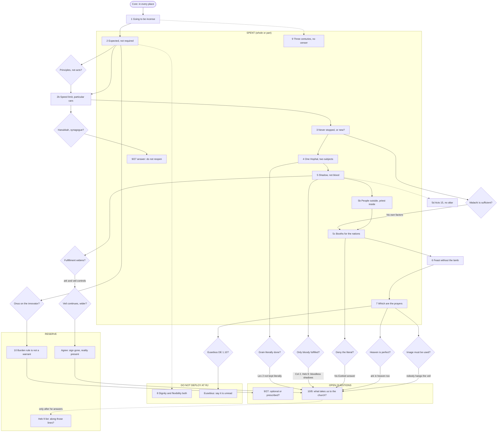

# Incense Outline Memory Card

<!-- PURPOSE HEADER. Maintained in place, not appended. -->

**AUDIENCE:** JD only.
**CLASS:** INTERNAL, not relay-clean; this file contains sequencing and branch material by design.
**FUNCTION:** Memory aid derived from `Incense_Conversational_Outline.md`.
**HANDLING:** Never shared, never relayed.

<!-- END PURPOSE HEADER -->

**Last updated: 260835-74** (date-stamped, format yymmdd-iteration)

> **DERIVATION POINTER.** Derived from `Incense_Conversational_Outline.md` at its stamp **260835-72** (repo HEAD `a5d8cc9`): every step, the Deployment map, the `260835-72` overlay, its sixteen-item reserve register, and the dated notes. Question state is taken from `PROJECT_STATE.md` §1 to §3 and `RJ_Final_Question_List.md` v23, both at `260835-72`. Quotations attributed to Rev. James are taken from `St_Francis_EMC_Distinctives.md` and, for the Followup thread, checked against `src/SRC_Discord_Followup-raw.txt` (sha256 `48bb0a58…`).
>
> **This card changes nothing in the outline. If the card and the outline ever disagree, the outline wins and the card is stale.** Once the outline's stamp moves past `260835-72`, treat the card as stale until it is re-derived.
>
> ⚠️ **DATED NOTE, 260835-74:** the outline's stamp moved to `260835-74` (its C11 `DQ`/`IP` review and dated notes); this card was **not** re-derived, so by its own rule above it is **stale until it is**. The pointer above is left at `260835-72`.

## Changelog

- **260835-74 (2026-10-09):** One dated note added below the Layer A table: Step 2's prescribed-not-permitted point was posted on 10/9 in JD's own words, byte-verified in both captures of the Followup raw, with the wording JD later edited recorded beside the wording that now stands. One dated stale note added beside the derivation pointer, because the outline's stamp moved to `260835-74` and the card was not re-derived. No row of any table was edited.
- **260835-73 (2026-10-09):** Card created. It has four layers: (A) the logical flow, one line per step in the outline's order, each with a cue, a one-sentence claim, an anchor and the step's state from the Deployment map; (B) the branch map for twelve anticipated replies, each ending at one of the two open questions; (C) a Mermaid flowchart with SPENT, RESERVE and DO NOT DEPLOY AT RJ subgraphs; (D) the spoken core verbatim, a labeled 60-second compression, and the three-question drill. Four brief items were corrected against the record rather than carried. (1) Luke 1:9-10 puts the people outside and Zacharias inside; the brief's cue had them reversed. (2) Cyril's reading is Tier 1, verified by JD against the page on 2026-10-09 (`260835-72`); the brief's "print check pending" is stale. (3) The brief's guard "he has stated no sorting rule" is superseded by `DQ-37`(b), "fulfillment widens"; the three-pattern sort remains the project's. (4) "Instituted means required" is not used as a cue, because that phrase was never posted (grep 0, `260835-72`). The brief's cue "nobody keeps Leviticus 2" is also replaced by a modal-split cue, because "nobody keeps" has the same shape as the "nobody performs" clause the outline retired at `260835-3`. The only other edits are in `PROJECT_STATE.md`: a new §4 row for this card, one changelog line, and that file's own stamp and §4 row bumped to `260835-73` so that its version check (C3) stays in agreement.

**How to read the tags.** `[Stated, tag]` means his own words, on the record. `[Analysis]` means the project's inference, never his. "JD" marks JD's own posted words. Quotations are here so a reply is recognized on the spot; before any of them is quoted back at him, check it against its source.

---

## Layer A: the logical flow

| Step | Cue | Claim | Anchor | State |
|---|---|---|---|---|
| Core | In every place | The core names one claimed act of worship and two warrants that pull apart, and it ends with the prayers we already offer. | Mal 1:11; Rev 5:8 | UNSPENT; never spoken aloud |
| 1 | "Going to be incense" | Start from the defender's own claim: incense is a Godward act on Malachi's warrant, so only the warrant is in question. | Mal 1:11; [Stated, `DQ-19`(c)] | UNSPENT |
| 2 | Expected but not required | Incense is an element by its defenders' own account, and "expected but not required" is a fourth category that owes an account. | [Stated, `IP-12`]; JD 10/8, the WCF 1.6/21.1 line | PART-SPENT 10/8 (WCF line); framework unspent |
| 2b | Speed limit, particular cars | A principle of worship is a principle about acts, and a rule that admits by resemblance filters nothing. | Ex 32:5 (a "feast to the LORD"); the Decian certificate | UNSPENT; generic framing only |
| 3a | Never rescinded, then Exodus 30 | If incense never stopped, Exodus 30 never stopped either: sanctuary only, Aaron's sons only, the prescribed compound only. | Exod 30:1-9, 37-38; Lev 10:1-2; Heb 7:12 | PART-SPENT (Exod 30 on 10/4; Heb 7:12 on 10/8, 10/9) |
| 3b | One verse, no institution | A new institution would rest on one prophetic verse in cult vocabulary, with no New Testament institution and no specified content. | Mal 1:11; 1 Tim 2:8; Rev 5:8 | SPENT 10/8, restated 10/9 (OPEN) |
| 3c | One claim, not two | Calling continuity and prophecy one claim assumes the disputed "never rescinded" and moves the argument to the priesthood. | Heb 7:12; Lev 16:12-13 | UNSPENT; his third reading stated 10/8 (`DQ-37`(b)) |
| 3d | Why need Malachi? | If it never stopped, why does it need Malachi; if Malachi institutes it, why insist it was never rescinded? | Step 3(d) wording | UNSPENT; fork not put |
| 4 | One Hophal, two subjects | Incense and the *minchah* share one verb, and no new rite was instituted for incense as the Eucharist was for the offering. | Mal 1:11 (*mugash*); Lev 2 | SPENT 10/8 (posted form), 10/9 (modal split) |
| 5 | Shadow, not blood | Scripture's line is shadow and substance, and Levitical-priesthood signs cease unless Christ reinstitutes them. | Col 2:16-17; Heb 9:2-4; Lev 24:7 (frankincense on the loaves) | SPENT 10/9 (narrow principle, his own examples) |
| 5b | People outside, Zacharias inside | The incense meant prayer carried in by a priestly mediator, and both referents are present realities now. | Luke 1:9-10; Lev 16:12-13; Heb 7:25 | PART-SPENT 10/8, 10/9; re-staged distance unspent |
| 5c | Booths for the nations | Every parallel prophecy in Levitical vocabulary is read as figure, so Malachi's incense cannot be the lone literal case. | Zech 14:16; Jer 33:18 (Levites kindling the *minchah*); Mal 3:3-4 | PART-SPENT 10/8, 10/9; Mal 3, Isa 19, Jer 33 unspent |
| 5d | Acts 15, no altar | Temple attendance before AD 70 was accommodation, and the apostles never routed the Gentiles to the altar. | Acts 21:23-26; Heb 8:13; Acts 15 | UNSPENT |
| 6 | Feast without the lamb | The command lands on the signified reality, and every continued sign received a new institution; the Passover is his own example. | 1 Cor 5:7-8; [Stated, `DQ-8`]; 1 Tim 2:8 | UNSPENT as argument; Passover named once 10/9 |
| 7 | Which are the prayers | We join heaven's worship, but the vision glosses its own furniture, and the image-needs-use rule is applied only where practice already is. | Rev 1:20; 4:5; 5:8; 19:8; 11:19 (ark in heaven too) | PART-SPENT 10/8, 10/9; four-verse cluster unspent |
| 8 | Dignity and flexibility both | Warranted human ordering wants divine dignity and human flexibility at once and cannot say which governs. | Articles 20 and 34; [Stated, `IP-12`] | DO NOT DEPLOY AT RJ (he affirmed the RPW, `DQ-4`); third parties only |
| 9 | Three centuries, no censer | English worship was incense-free from the late 1540s to the 1850s, and the practice was condemned when tested. | *Elphinstone v. Purchas* 1870; the 1899 Opinion; Church of Ireland canon | SPENT 9/5, 9/8, 9/17, 9/27; closed by JD 9/17 |
| 10 | Burden rule is not a warrant | A rule for who must argue, or for what was received, gives no positive grounds for incense. | [Stated, `DQ-19`(a), `DQ-24`(b), `DQ-33`(b)] | RESERVE; trigger: "the onus is on the innovator" |

> ⭐ **DATED NOTE, 260835-74 (2026-10-09) — STEP 2's PRESCRIBED-NOT-PERMITTED POINT WAS ALSO POSTED ON 10/9, IN JD's OWN WORDS. THE TABLE ROW ABOVE IS NOT EDITED.** Its State cell reads *"PART-SPENT 10/8 (WCF line); framework unspent"*. **Add: SPENT 10/9 as well as 10/8.** JD's 10/9 3:23 PM post closes with the point stated as a consequence of Rev. James's own reading (archive message 61 of `src/SRC_Discord_Followup.md`).
>
> - **As first posted** (raw capture sha256 `48bb0a58…`, the `f69fbd4` state): *"If Malachi 1:11 institutes incense for the church in any sense, then it's required, because God doesn't institute worship yet not require it"* — **[byte @82,872–83,012]**, uniqueness-checked (1 occurrence). The cue *"God doesn't institute worship yet not require it"* is **[byte @82,964–83,012]** in that capture.
> - ⚠️⚠️ **As it now stands** (raw capture sha256 `63920d32…`, `HEAD` `47a8a4b`): JD **edited the post in place** after the `f69fbd4` capture. The sentence now reads *"If Malachi 1:11 institutes incense for the church in any sense, then it's required, because any worship that God institutes, He also requires it to be performed"* — **[byte @82,872–83,032]**. The paragraph continues *"; and as a result, if it only permits incense, then it doesn't institute it."* ⛔ **The brief's wording, *"God doesn't institute worship yet not require it"*, does NOT occur in the current capture (0 occurrences).** ⭐ **Rev. James's 10/9 5:24 PM post quotes the EDITED wording** (**[byte @87,696–87,856]**, archive message 64), so the edited form is the text he answered.
> - **Available Step 2 cues, both JD's own words:** *"God doesn't institute worship yet not require it"* (as first posted; short and memorable; no longer in the posted text) and *"any worship that God institutes, He also requires it to be performed"* (as it now stands; the form on the record and the form he quoted). ⏳ **Which to carry as the cue is JD's choice.** Recorded rather than chosen.
> - ⚠️ **The point is no longer unanswered in the thread.** Rev. James's 5:24 PM post (archive message 64) quotes this paragraph and replies to it. ⛔ That reply is **not yet minted** (no `DQ-38`), so the card does not characterise it. Read it in the archive before relying on this cue.
> - *(The 260835-74 C11 review also found that Step 2's three-category framework was posted in full on 9/17, which the row's "framework unspent" does not reflect. See the outline's `260835-74` REVIEWED block. The row is left as derived.)*

## Standing guards (these travel with every layer)

- **Attribution.** Never attribute "violating Malachi 1:11" to him. That line is a rhetorical question inside his own reductio (`BP-39`), and the generic framing in the core and Step 1 must stay generic.
- **Rev 5:8 grammar.** Say "the bowls full of incense are the prayers." Never say "the incense is the prayers." The Rev 8:3 "with the prayers" form is RETIRED (do-not-deploy register), and JD used it once, on 10/8.
- **Misattribution.** "On 9/8 you read it as fulfilled in the Eucharist" is a MISATTRIBUTION and is DO NOT DEPLOY. JD said the fathers read it so; he has not said so on Discord.
- **Step 5.** Use the narrow principle only. The broad form, "fulfilled symbols cease," is DO NOT DEPLOY. His "uniquely Old Testament" qualifier (`IP-100`) answers Step 5 in one sentence if it is used without that qualifier in hand.
- **Step 3.** He reads the clause as fulfilled, not as figurative. Never call his reading figurative or allegorical, because he answers that in one sentence.
- **Step 4.** Use the modal-split form only ("may be kept in the antitype; it is certainly not kept literally, by either of us," JD 10/9). Never charge him with spiritualizing one clause. The *minchah* seam objection is undischarged, and nothing may be built on his having noticed the asymmetry (`IP-98`).
- **Step 7.** Its machinery does not reach the Incarnation ground (`IP-103`: "Heaven and Earth are united"). If that ground comes up live, Step 7 has no answer ready.
- **The one hole.** The ritual-act-as-pedagogy warrant (`IP-101`) is met by no step. A conversation that reaches it has nothing prepared.
- **Not quotable at him.** `IP-84` and `IP-114` are under open ear flags. `IP-85` is absolute DO NOT DEPLOY. Eusebius *DE* 1.10 is UNREAD. The Perowne and Simeon wordings are unverified and unsourced.
- **Step 9 history.** The 1974 Measure repealed the Act of Uniformity 1662 "except sections 10 and 15." Never say a bare "repealed." The history also does not defeat incense on his own durational floor (`DQ-26`(b)), so do not claim that it does.
- **Step 8** is DO NOT DEPLOY AT RJ, whatever the temptation.

---

## Layer B: the branch map

Each row starts from a reply the outline anticipates. Where he has stated the move, it appears in his own words with its tag; where he has not, the row says so. Every branch that bottoms out goes to one of the two open questions at the foot of this layer.

| If he says | Go to | Say | Guard |
|---|---|---|---|
| "An image doesn't work if it's not being used. It has to be used for it to work." [Stated, `BP-38`, video]; "a symbol doesn't work well if it's not there" [`RC3-8`]. Not yet said in the Followup thread. | 5b, then Step 7 cluster | Lead with the veil: its meaning works because it is gone, everyone passes through it, and nobody hangs one (Heb 10:19-20). Then ask why the image-needs-use rule applies only to the one glossed item already in practice. | Neither answer reaches the `IP-103` Incarnation ground. The veil sentence was already posted 10/9 as a statement. |
| "I would need a strong argument as to why we should not allow that particular practice, given that Heavenly worship is perfect." [Stated, `DQ-16`] | Step 7; Rev 11:19 | We do join heaven's worship (Heb 12:22-24), and the ark is in heaven's temple too (Rev 11:19), yet nobody builds one. | Concede participation in full and contest only the inference to physical reproduction. Rev 11:19 was posted 10/9. |
| "Malachi 1:11 is then sufficient" [Stated, `DQ-37`(b)]; "the Prophet Malachi tells us that there is going to be incense in the New Testament Church's worship" [Stated, `DQ-19`(c)] | Step 3b; Step 5c | By your own factors, "context to feasibility to purpose" [Stated, `DQ-17`], what carries Malachi's incense and not Zechariah's Booths (Zech 14:16) or the Levites kindling the *minchah* (Jer 33:18)? | Mal 3:3-4 is strong but not airtight, and the Step 5c ranking caveats stand. Jer 33:17-18 is unspent. |
| "I need a strong case to deny the literal meaning of it for the sake of the allegorical." [Stated, `DQ-37`(d)] | Step 5c; Step 7 | Point to his own Ezekiel answer, "more or less apocalyptic," limited by Hebrews [Stated, `DQ-18`]. Then cite the Rev 5:8 gloss he shares ("a symbol of prayer," [Stated, `DQ-19`(c)]), Irenaeus *AH* 4.17.6, and Cyril on Malachi. | Do not call his reading allegorical back at him; fulfilled is not figurative for him, and JD has said so too ("Fulfillment isn't figurative," 10/9). Cyril is Tier 1, but his v.12 line ("their incense fragrant") must be read with the spiritual-incense gloss before it. |
| "the fulfillment is always more and greater than the foreshadow"; "would allow for more than just Aaron's descendants to use incense" [Stated, `DQ-37`(b)] | Step 5 narrow principle | His own examples ceased and were replaced: circumcision by baptism, the showbread by the Supper (Acts 15; Lev 24:7, frankincense on the loaves). The ark and the veil are the controls (Heb 9:4; 10:20). Rev 11:19 and Zech 14:16 show things mentioned in heaven and prophecy that did not continue. | His only stated sorting rule is "fulfillment widens." The three-pattern sort is `[Analysis]`, the project's, and must never be put to him as his. |
| The veil continues as Christ's flesh, with wider access, so widening is the pattern. (Anticipated; he has not said it.) | Agree (reserve item 15) | Agree: that is the sign ceasing, the reality present, and access widened to the reality. Incense continues the same way, as the prayers of the saints through the interceding priest. | Do not post the incense parallel ahead of his reply (reserve item 15, the hybrid pre-emption bar). |
| The grain offering is "literally done today," so both clauses are enacted. [`IP-114`, in person; open ear flag; NOT quotable] | Step 4 institution pivot | The Eucharist is a rite Christ instituted. The Leviticus 2 rite itself may be kept in the antitype, and it is certainly not kept literally, by either of us. | The *minchah* seam objection is undischarged. Never allege that he spiritualizes one clause. |
| "The onus is upon the innovator who insists that we must have these particular practices done" [Stated, `DQ-24`(b)]; "you hold the burden" [Stated, `DQ-33`(b)] | Step 10 (RESERVE) | A rule for who has to argue is not a warrant for what may be offered. | Step 10 is formally in reserve. JD's circularity objection is JD's to spend, not a pass's. The burden question is already on record from both sides (`DQ-33`(b); JD 9/27). |
| "the RPW is about principles and not individual acts." [Stated, `DQ-9`]; "All principles of worship must be derived from the Commands of God in Scripture, or by consequence of the Biblical witness." [Stated, `DQ-30`(a)] | Step 2b | A rule that regulates worship regulates acts. "Prayer is owed to God alone" rules out a particular prayer, and that is the work a worship principle does. | Use the generic framing only (Option A). `IP-84` is not quotable, and `IP-85` is DO NOT DEPLOY. `DQ-9` is still unmoved. |
| "Only insofar as it is rejecting Christ's one sacrifice would it be bad." [Stated, `IP-3`, in person; never used on Discord] | Step 5, point 2 | Colossians 2:16-17 and Hebrews 9:2-4 call bloodless things shadows: food, sabbaths, the table, the altar of incense. | He has not used this on Discord. His Discord grounds have moved: 8/21, the symbol of prayer with prayer unchanged (`DQ-19`(c)); 8/25 to 8/28, reception, stated generally and never applied to incense by name (`DQ-24`(b), `DQ-25`, `DQ-26`); 10/8, fulfillment widens (`DQ-37`(b)). That is an observation about the record, not a charge. |
| Hanukkah and the synagogue as warrants [Stated, `DQ-31`(a)/(b), 9/11] | The 9/27 answer, already posted | JD 9/27: "Presence at a national feast is not the church instituting a new cultic rite." The synagogue was "a form, a circumstance, for a commanded element," and it "never had an altar, a sacrifice, or incense." | Do not reopen. He has not replied to it. |
| "So, then, we sacrifice and offer incense." (Eusebius, *DE* 1.10; UNREAD) | The scripted honest answer | Say plainly that you have not read the chapter yet (`Orthodox_Bridge_Rebuttal_Assessment.md` §7.3, item 4). | Do not contest it unread. The *DE* 1.6 "incense of prayer" gloss is also unverified. |

**Where every branch ends: the two open questions.** Both are JD's, both are posted, and both are OPEN (`PROJECT_STATE.md` §3 is the authority on their state).

1. **The 9/27 question.** Optional, prescribed, or something else? JD: "I'm not asking you to abandon either position. I'm asking which one you keep, because I don't see how both can be held at the same time."
2. **The 10/8 question.** JD: "what takes us from "someone other than Aaron's sons offers incense in these passages" to "the church may offer it in its worship"?" JD restated it on 10/9 in his own words: "what takes incense from the Aaronic restriction disappearing to the sign itself continuing, when the sign didn’t continue for circumcision or the showbread?"

---

## Layer C: the flowchart

The cues from Layer A label the nodes. The spine is the outline's order. Diamonds are his anticipated replies. Subgraphs carry state: SPENT includes partly spent steps, and anything outside a subgraph is unspent.

*Rendering: `mmdc` is not installed on this machine, so no PNG or SVG was produced. GitHub and VS Code render the block above.*

---

## Layer D: the spoken core check and the three-question drill

### The two-minute spoken core (verbatim from the outline, JD's text)

> "The defenders of incense in worship don't treat it as a mere circumstance, and they're right not to: they ground it in Malachi 1:11 as 'a standard part of the worship of the people of God in the New Testament church,' and press whether a church without it is violating that verse. That makes it a claimed act of worship on divine warrant, and the question is whether the warrant holds. The warrant offered comes in two versions that pull against each other. Either incense never stopped, in which case the incense law never stopped either, and that law made incense outside the sanctuary, by non-priests, with a non-prescribed compound, a capital offense. Or Malachi institutes something new for the new covenant church, in which case one prophetic verse, in Old Testament sacrificial vocabulary, with a grain offering in the same breath which may be kept in the antitype but is certainly not kept literally, is carrying the whole weight, against the New Testament's own reading that the incense is the prayers of the saints. Which we do offer. In every place."

*Guards on the core, recorded here and not edited into it.* The core is UNSPENT and has never been tested aloud. Its "violating that verse" framing is the generic Anglo-Catholic case and must never be attributed to him (`BP-39`). Its closing "the incense is the prayers of the saints" differs from the reserve-item-12 grammar ("the bowls full of incense are the prayers"); that is flagged here, and the wording is JD's to change.

### A 60-second compression (for memorization only; not a replacement for the core)

> The people who defend incense don't treat it as a mere circumstance. They ground it in Malachi 1:11, so it's a claimed act of worship, and the only question is whether that warrant holds.
>
> The warrant comes in two versions, and they pull against each other. If incense never stopped, the incense law never stopped either, and that law kept it to the sanctuary, to Aaron's sons, and to one compound.
>
> If Malachi institutes it fresh, one prophetic verse is carrying all the weight. That verse is in Levitical vocabulary, and it puts a grain offering beside the incense that may be kept in the antitype but is certainly not kept literally.
>
> The New Testament tells us what the incense was. The bowls full of incense are the prayers of the saints, and we offer those, in every place.

### The three-question drill

**The rule.** No new question goes out while one is unanswered. Two are open now (`PROJECT_STATE.md` §1 and §3), so the third waits behind both.

1. **The 9/27 question (OPEN).** Optional, prescribed, or something else? *Trigger:* it is already posted and standing, so restate it only if he answers around it. *Guard:* quote his positions and do not paraphrase them; he asked for that on 9/28 (`DQ-34`(b)).
2. **The 10/8 question, in JD's own terms (OPEN).** What takes incense from the Aaronic restriction disappearing to the sign itself continuing, when the sign did not continue for circumcision or the showbread? *Trigger:* it is posted (10/8) and restated (10/9), so it waits for his reply. *Guard:* these are JD's words and are never attributed to him; the pattern sort behind the question is the project's.
3. **The reserve Heb 9 question (QUEUED, not drafted as posted text).** It builds on his rule: "we don't do the sin offerings precisely because of the Book of Hebrews, which means that if there is something along those lines on another component of worship we would follow suit" [Stated, `DQ-19`(d)]. Does the altar of incense, listed beside the table of showbread as first-tabernacle furniture, "a figure for the time then present" (Heb 9:9), count as something along those lines? *Trigger:* the 10/8 question is answered. *Guard:* he has not said that the Heb 9 list triggers his conditional, so ask and never assert. Say "altar of incense (the KJV's 'golden censer')," because the rendering of θυμιατήριον is disputed.
